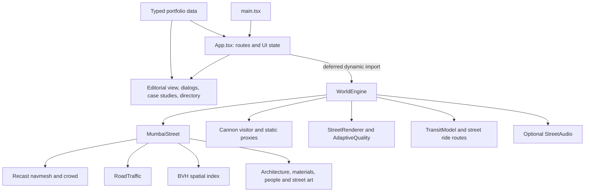

# Current implementation — Harsh Jha Mumbai portfolio

**Snapshot:** 10 October 2026, implementation commit `878b13f`, branch `feature/mumbai-production-overhaul`.

This document describes the implemented application, rather than the intended final design. The documentation commit containing this file follows the implementation snapshot. Historical QA documents describe earlier checkpoints; the most recent visual evidence is [CST–Fort polish](CST_FORT_POLISH.md).

## 1. Product and completion status

The portfolio has two complementary experiences: a first-person, stylized Mumbai street for exploration, and an HTML portfolio for reading projects, experience, skills and personal information. The physical world is a **single CST–Fort vertical slice**, not nine completed districts. Visitors walk at human scale and can ride a taxi or auto as passengers. A personal third-person car is not exposed as the primary experience.

The slice includes arrival architecture, fourteen main façades, bilingual shopfronts, sidewalks, a zebra crossing, street vegetation and utilities, a station host, parked taxi/auto stands, moving pedestrians, three ambient traffic vehicles and a walkable Fort research room. The latest polish adds station-side arcades, original shaped people, shop-specific merchandise, draped awnings, compound foliage and more detailed passenger cabins.

Nine destinations exist in the HTML directory. Seven have no corresponding expanded physical street. Film City is a text-led HTML slideshow, not a completed walk-in 3D cinema. Functional checks pass, but visual equivalence to the supplied reel has **not** been established. Characters, repeated architecture and the end-of-street boundary still look procedural. A provisional triangle budget also remains slightly exceeded in one desktop view.

The implementation is saved locally. No production push or deployment was performed in the latest polish pass, and no current public URL is asserted by this document.

## 2. Technology and application structure

| Layer | Current implementation |
| --- | --- |
| Application/UI | React 19.2, TypeScript, semantic HTML and CSS |
| Development/build | Vite 7.1, React Vite plugin; production output `dist/` |
| Rendering | Three.js 0.180; WebGLRenderer; optional postprocessing 6.39.5 |
| Walking physics | cannon-es 0.20 |
| Static spatial queries | three-mesh-bvh 0.9.15 |
| Wall opening generation | three-bvh-csg 0.0.18 |
| Crowd navigation | @recast-navigation/core, generators and wasm 0.43.1 |
| Unit/integration tests | Vitest 4.1 |
| Browser regression | Playwright 1.56; cloud override uses installed Chromium/SwiftShader |
| Hosting configuration | Vercel and Netlify static build configurations |

Exact installed dependency resolutions and integrity digests are in `package-lock.json`. Some original manifest ranges remain ranges; the six navigation/rendering additions are pinned. This is a static browser application: the current code provides no application backend, account system or payment service.



### Main source responsibilities

| File or directory | Responsibility |
| --- | --- |
| `src/main.tsx` | React entry and stylesheet imports |
| `src/app/App.tsx` | Modes, route handling, overlays, world initialization, transport controls, motion/sound/preset state and fallback |
| `src/ui/EditorialHome.tsx` | Editorial landing and entry transition |
| `src/ui/CityExperience.tsx` | Destination directory, district content, ride instruments and theatre |
| `src/ui/CaseStudy.tsx`, `ProjectDemo.tsx`, `ProjectGraphic.tsx` | Project presentation and supporting visuals/demos |
| `src/ui/Modal.tsx` | Shared native-dialog lifecycle and focus handling |
| `src/core/WorldEngine.ts` | Scene lifecycle, camera, input, physics stepping, interactions, ride states and cleanup |
| `src/core/StreetRenderer.ts` | Render presets and composition |
| `src/core/AdaptiveQuality.ts` | Sustained-frame-rate sampling and render-scale hysteresis |
| `src/core/StreetAudio.ts` | Opt-in synthesized audio |
| `src/game/World/MumbaiStreet.ts` | Street assembly, collision proxies, people, traffic, interactions and updates |
| `src/game/World/StreetArchitecture.ts`, `architecture/FacadePanels.ts` | Seeded architectural components and cached through-cut walls |
| `src/game/World/StreetMaterials.ts`, `architecture/StreetArt.ts` | Procedural surfaces, cloth and weathering |
| `src/game/World/npc/` | Original people, garment surfaces and seated driver baking |
| `src/game/World/navigation/NavMeshManager.ts` | Bounded Recast geometry, mesh, queries and crowd ownership |
| `src/game/World/traffic/RoadTraffic.ts` | Persistent curve-based ambient traffic and yielding |
| `src/game/World/spatial/SpatialIndex.ts` | Trusted static BVH queries |
| `src/game/World/WalkingBody.ts` | Upright visitor collision body |
| `src/game/World/TransitModel.ts`, `streetLayout.ts`, `transit.ts` | Taxi/auto geometry, active street routes and meter calculations |
| `src/data/` | Portfolio identity, projects, experience, skills and destination definitions |
| `scripts/capture-street.mjs`, `profile-street.mjs` | Reproducible native captures and CPU-only simulation profile |

Older `Campus.ts`, `Vehicle/` and radial helpers in `transit.ts` remain in the repository. Their presence does not imply that the earlier personal-car or radial nine-district world is the active user experience. Current world construction uses `MumbaiStreet`; active passenger routes use `streetLayout.ts`.

## 3. Entry, routes and UI lifecycle

Application modes are `intro`, `world` and `quick`. Quick View presents the portfolio without waiting for the renderer. `WorldEngine` is imported dynamically after the initial UI paint, with an 80 ms scheduling delay when world loading is requested. Starting directly in Quick View avoids requesting the world until necessary. Intro can request the world ahead of entry.

| Hash | Behavior |
| --- | --- |
| Empty/unrecognized | Intro mode |
| `#world` | First-person street |
| `#quick` | HTML portfolio |
| `#about` / `#projects` | Quick View with section navigation |
| `#/project/<id>` | HTML project case study; project IDs are decoded safely |
| `#/place/<id>` | District content dialog in the world mode |

Hash changes and browser history events update application state. Opening a project/district overlay does not silently move the visitor's camera. Directory travel to CST or Fort uses physical street stops; other destinations open their HTML experiences. Search uses case-insensitive matching of all query words across command labels, details and keywords, with keyboard selection and execution.

The interface retains résumé, GitHub, contact, project and research links. Résumé availability is checked by a same-origin HEAD request requiring a PDF content type. Project selection updates the document title and description metadata. The actual portfolio claims remain typed data with source qualifiers; see [SOURCES.md](SOURCES.md).

## 4. Destination content and physical scope

The following names are the **current data titles**, which differ from some earlier proposed names. No silent renaming is implied by this document.

| ID | Current title | Content | Physical implementation |
| --- | --- | --- | --- |
| `cst` | CST Arrival Terminus | Introduction and orientation | Arrival area, host, station façade/arcades, stands and street stop |
| `fort` | Fort Research Institute | GSoC, QC-Devs/Theochem, FFprime | Street frontage, open doorway, research room and terminal |
| `bkc` | BKC Systems House | CCIEeXpert internship | HTML destination |
| `andheri` | Andheri Tech Bazaar | Skills and supporting evidence | HTML destination |
| `powai` | Powai Builder’s District | Main project collection | HTML destination |
| `dadar` | Dadar Junction | Journey/timeline | HTML destination |
| `worli` | Worli Proof Deck | Achievements and qualified metrics | HTML destination |
| `juhu` | Juhu Studio | About, résumé and contact | HTML destination |
| `filmcity` | Film City Talkies | Nine-scene portfolio story | HTML theatre/slideshow |

Coordinates in `src/data/city.ts` preserve invented directory/model metadata; they are not proof that nine physical districts are built. Current walkable stop coordinates come from `streetLayout.ts`: CST at `(4.6, 11.5)` and Fort at `(-5.1, -35)` in world X/Z metres.

### Project data currently shipped

`src/data/projects.ts` contains six project records. Hero selection uses priority ≤4; directory grouping and prominence do not change the underlying records.

| Project ID | Title | Subject |
| --- | --- | --- |
| `ffprime` | FFprime | Multipole electrostatics/scientific computing |
| `northstar` | NORTHSTAR | AI market research |
| `reco` | RECO | AI revenue recovery |
| `moneymetrics` | MoneyMetrics | Personal finance intelligence |
| `meeting-intelligence-service` | Meeting Intelligence | Transcript-to-action workflow |
| `rideflow` | RideFlow | Multimodal journeys |

Project records drive case studies and retain repository links, evidence, constraints and presentation metadata. Old `worldPosition`/landmark metadata in those records is not a set of completed physical buildings in the current street. Update portfolio claims in `src/data/` and preserve source qualifiers rather than embedding new claims in world geometry.

Film City supports previous/next, scene selection and autoplay controls. It is text-led and does not autoplay audio. It remains available through the HTML fallback.

## 5. Walking, camera and interactions

The visitor uses a 70 kg Cannon body with fixed rotation and four radius-0.32 m spheres stacked vertically, approximating a rounded upright volume. There is no jump mechanic. Static world proxies provide collision; detailed display meshes and physics proxies are separate concerns. Cannon remains authoritative for walking/grounding; BVH ground queries do not replace it.

Walking runs at a fixed `1/60` second physics step using an accumulator. Frame delta is bounded to 0.08 seconds for the walking loop. Horizontal acceleration/deceleration blends velocity toward the requested camera-relative velocity. Normal speed is 2.7 m/s and brisk walking is 4 m/s. Diagonal input is normalized so it does not produce a faster diagonal walk.

The camera uses FOV 68 degrees and an eye-level target around 1.68 m. Walking bob is bounded to 12 mm and disappears in reduced motion or while paused. The visitor does not see a third-person personal avatar/car view.

| Input | Action |
| --- | --- |
| WASD / arrow keys | Camera-relative walking and strafing |
| Shift | Brisk walk |
| Mouse click | Request pointer lock where supported |
| Mouse drag | Look when pointer lock is unavailable; mobile look input |
| Comma / period | Keyboard turning |
| E | Interact with the eligible nearby host, terminal or vehicle |
| R | Reset to CST |
| M | Open the destination directory |
| Escape | Release pointer/open menu or close an active overlay |
| Ctrl+K / Cmd+K | Open command palette |
| Touch direction buttons | Hold to walk |

The static spatial index validates finite positions, triangle/index structure and a combined 250,000-vertex budget before building its BVH. It accepts authored geometry only, not visitor uploads or remote meshes.

Interactions combine proximity with trusted BVH visibility, rejecting targets behind static walls. Opening an overlay pauses movement and releases pointer lock; input is cleared on mode changes, pause, blur and visibility changes. Inputs in text fields are not treated as movement commands. Hidden pages stop world work and suspend optional audio.

## 6. Street geometry, materials and visual polish

The street is authored at human scale, with deterministic variation rather than a geographically accurate Mumbai map. Four façade grammars vary openings, shutters, balconies, parapets and frontage details. CSG wall sections have actual through-openings and are cached per grammar. This construction happens once, outside the frame loop; offline baking remains an optimization opportunity.

Repeated geometry is instanced. Shop signs share an atlas. Static taxi/auto body panels are merged by material, while wheels remain articulated. The original visual assets are generated through project code and canvas textures; no external character pack, scanned vehicle or downloaded HDR is integrated.

The latest pass includes:

- Draped, striped awnings with sag and irregular hems, replacing rigid flat canopies.
- Projecting CHAI/PAPERS/BOOKS/OPTICS signs and differentiated radios, book stacks, bread trays, spectacles and chai props.
- Restrained irregular wear positioned on solid façade piers, merged into one weathering draw.
- Branched trees with paired compound leaflets instead of disconnected leaf flakes.
- Framed open Fort doors, entrance reveal, planters and research wayfinding.
- Open station-side arcades, with collision proxies on the real columns/rear structures and a roof above head height.

The outdoor lighting uses a warm directional sun at `(-28, 23, -52)`, intensity 2.65, a cooler hemisphere at intensity 1.0, muted sky colors and fog spanning 65–145 m. A 2048² directional shadow map uses bounded refreshes during motion. Four existing local lights serve the room/shop atmosphere; no additional large light population was introduced by the polish.

A Three.js RoomEnvironment/PMREM supplies restrained reflections at environment intensity 0.22. It is an approximation, not a captured Mumbai environment. Output is sRGB with exposure 1.12 and a single ACES tone mapper. No bloom, vignette, grain, chromatic aberration or depth-of-field is used.

## 7. People and authored crowd navigation

`NPCFactory` generates original vertex-colored skinned people using sixteen bones. Geometry includes shaped jaws/cheeks/ears, eyes, brows/lips, swept hair, individual fingers, collars and trouser details. Seeded color, height, sleeve length and animation phase provide bounded variation. Walk, idle and seated motions are authored procedurally; they are not motion-capture clips.

Close and street geometry levels share the same skeleton and valid skin weights. Detailed people within 10 m use higher radial detail and a 24-resolution garment surface. Farther people use fewer radial segments and 16-resolution garments. Animation throttles to 10 Hz beyond 18 m and figures cull beyond 48 m. This is geometry LOD, not skeletal LOD. Two CPU garment templates are cached; both owned mesh detail levels and skeleton resources are disposed during world teardown.

Ten moving people use a Recast/Detour crowd. The generated navigation region covers both pavements, the authored zebra crossing and the Fort room, excluding the remaining road. Fixed collider footprints remove obstacles. Input is bounded to 50,000 vertices and rejected if non-finite. The native crowd is configured for up to 24 agents, with current agent radius 0.24 m, height 1.8 m, maximum speed 1 m/s and acceleration 2 m/s².

People choose among six authored station/shop/commuter destinations, wait three to five seconds after arrival, and turn toward velocity. Crossing approaches wait for the pedestrian phase. Walkers pause near the visitor to reduce overlap. If navigation initialization fails, figures remain standing, portfolio controls continue, and diagnostics report `unavailable`.

There is no dynamic navmesh carving, visitor crowd agent, full city routine simulation or guaranteed collision-free interaction around temporary vehicles. Close faces and rigid clothing remain visual weaknesses despite the geometry improvements.

## 8. Ambient traffic

Three persistent vehicles follow a closed centripetal lane curve with smooth U-turns in the bounded carriageway. Agents preserve along-lane spacing, accelerate at bounded rates, brake at crossing approach lines and yield to a nearby player ahead. A shared 32-second signal gives pedestrians seconds 20–27. Traffic also yields to walkers still in the road after that phase ends.

Parked stands have physical proxies beside the station; moving ambient traffic is an authored simulation rather than dynamic vehicle physics. It has no arbitrary-intersection graph, route planning across nine districts or physical collision response between ambient traffic and boarded transport. Its lane curve is separate from the tested passenger waypoint routes.

## 9. Taxi/auto passenger experience

Ride state is explicit: `idle → hailing → boarding → riding → arrived`, with exit/cancel/reset recovery to walking. The visitor can hail through controls or nearby interaction, wait for pickup, choose CST/Fort, ride, skip and exit onto the pavement. Reduced motion avoids the animated journey and arrives directly. Unknown physical destinations do not create unbuilt ride routes.

Routes are deterministic two-lane waypoints with authored U-turns. Pickup is clamped to the street and kept clear of the station frontage. Distance and progress accumulate along route segments. Pickup speed is bounded to 4 m/s; riding approaches 5.2 m/s for taxis or 4.2 m/s for autos with acceleration smoothing and arrival slowdown. Heading is smoothed, and a small authored tilt/bob is removed by reduced motion. Displayed fares are decorative story values, **not payments or booking quotes**:

| Vehicle | Fare calculation |
| --- | --- |
| Taxi | `28 + distance × 0.48` |
| Auto | `23 + distance × 0.36` |

Models have original shaped bodywork and rotating wheels. Drivers are baked once from the posed original people, including transformed normals and forward-facing seated legs. No runtime driver skeleton is allocated for traffic.

`createTransitModel(kind, cabinDetail)` defaults to the cheaper `street` variant for parked/ambient vehicles. Boarded WorldEngine vehicles explicitly request `close`. Both retain matching outer bounds; detailed cabins add upholstery/stitching, pockets, controls and instruments. Taxi details include right-hand steering, vents, gear lever, lining, interior light, mirror and wipers. Auto controls and a forward driver position preserve an open passenger view.

A shared original 128² woven texture provides upholstery. Material batching retains mapped UVs and projects UVs where canopy geometry needs them. Passenger offsets are taxi `(-0.32, 1.37, 0.63)` and auto `(0.34, 1.34, 0.63)` relative to the vehicle, with limited look-around. These are stylized authored interiors, not accurate scanned cabins.

## 10. Quality, performance and resource ownership

| Preset | Rendering behavior |
| --- | --- |
| High | Half-resolution nine-sample SSAO, composition ACES and FXAA; desktop shadows when permitted |
| Medium | Direct renderer ACES, native antialiasing, desktop shadows when permitted |
| Low | Direct ACES; no effect targets or directional shadows |

Desktop defaults to Medium; mobile starts in adaptive low quality. Pixel ratio is capped at 1.5 desktop/1.25 mobile, then multiplied by adaptive scale. Mobile scale starts at 0.85. After a three-second warmup, quality samples sustained periods of at least four seconds/five frames: below 42 FPS it reduces scale in 0.1 steps down to 0.6; above 57 FPS it recovers in 0.05 steps up to 1. Low quality also reduces pedestrian density. This is a runtime response, not a guarantee of frame rate.

Reduced motion is independent of preset selection. It stops crowd/traffic animation, removes bob and ride animation, and renders on demand for camera/scene changes. Hidden/menu time and idle on-demand frames are not counted as performance evidence. Moving shadows refresh at a bounded interval around 0.2 seconds, rather than rebuilding every animation frame.

Renderer diagnostics aggregate all composition passes. Teardown cancels the loop, removes listeners/observer/input state, closes audio, destroys navmesh/crowd/query and BVH resources, and disposes unique geometry, inactive character LOD geometry, materials, textures, skeleton/bone textures, render targets, composer and renderer. Caches are bounded source templates, not an unbounded asset streaming system.

### Latest measured evidence

| Measurement | Result and interpretation |
| --- | --- |
| Native captures | 28 PNGs; 1440×900, 1920×1080, 390×844 mobile/fallback |
| Diagnostic measurements | 21, with desktop render scale 1.00 |
| Peak desktop draws | 102 |
| Peak submitted triangles | 231,164 |
| Peak textures / shaders | 28 / 24 |
| Provisional Medium triangle ceiling | 230,000; remaining excess 1,164, or 0.51% |
| CPU world construction | About 1,486 ms in the recorded Node profile |
| Street update | Mean 0.259 ms; p95 0.283 ms; p99 0.387 ms |
| Crowd update | Mean 0.049 ms; p95 0.088 ms; p99 0.131 ms |
| Traffic update | Mean 0.018 ms; p95 0.034 ms; p99 0.067 ms |

CPU results use 779 measured updates and ran alongside browser workload. They are not GPU/browser FPS or laptop benchmarks. Submitted render triangles are not a unique stored-mesh count. The triangle ceiling was not increased to make the result pass.

Recorded build chunks include WorldEngine 328.64 KB raw/97.57 KB gzip, Three 523.96/133.07 KB and Recast compat WASM 726.36/217.70 KB. Known large-chunk warnings remain. No external model/texture download payload was added during polish.

## 11. Accessibility, audio and fallback

The HTML experience remains independently readable. Native dialogs provide focus handling, keyboard closure and labeled controls. Touch walking/look controls support mobile. Reduced-motion preference is read from the OS and optional `hj-motion` local storage; storage failure is tolerated. Sound starts disabled.

Enabling sound creates a Web Audio context with original seeded filtered noise, an engine oscillator and synthesized footsteps. It is suspended while paused/hidden/outside world mode and closed at teardown. There is no shipped reel audio or recorded city sound pack.

WebGL initialization failure or context loss returns the visitor to Quick View, with a visible explanation and retained content. `?webgl=off` deliberately exercises fallback. A usable fallback is implemented; comprehensive assistive-technology certification and every browser/device combination are not claimed.

## 12. Dependencies, assets and security review

All current new street geometry/textures are original procedural work. The supplied reel is a local visual reference; its frames are not shipped. Quaternius' canonical character publisher/itch pages were reachable on 10 October and list CC0, but their actual archive redirected to blocked Google Drive. No archive bytes, extracted scripts or unverified mirror assets were imported.

The six added rendering/navigation packages received manifest/lifecycle/dependency review, registry SHA-512 integrity checking and independently verified registry ECDSA signatures. The signature audit tool could not complete Sigstore/TUF attestation fetching through the proxy, so comprehensive provenance attestation is not claimed. The latest unchanged lockfile advisory audit reported zero known vulnerabilities; this is not an exploit/malware certification.

Vercel config provides same-origin CSP, `wasm-unsafe-eval` for local Recast WebAssembly, no JavaScript `unsafe-eval`, no objects/framing, `nosniff` and a referrer policy. React inline styles remain permitted. Production source maps are not enabled. The Netlify file configures build/cache/PDF headers but does not contain the same full CSP/header policy; hosting parity needs separate work. Production header behavior has not been verified by deployment in this pass.

See [ASSET_PROVENANCE.md](ASSET_PROVENANCE.md), [SECURITY_DEPENDENCY_AUDIT.md](SECURITY_DEPENDENCY_AUDIT.md), `CREDITS.md` and `public/THIRD_PARTY_NOTICES.txt` for the underlying record.

## 13. Tests and evidence chronology

The implementation checkpoint records:

- **62 unit/physics cases passing**, including navigation WASM, spatial queries, data/routes, walking, traffic, posed knees, finite baked driver surfaces, shared-skeleton geometry LOD and lower-cost ambient vehicles with matching bounds.
- **TypeScript and production build passing**, with visible Vite chunk warnings.
- **35 Chromium regression cases passing** in 14.5 minutes, one worker and a 180-second command-line cloud timeout.
- **Five focused browser cases passing** after final geometry/UV/hand/arrival changes: entry, walking/reset/pause, reboarding, Fort terminal and presets.
- **Three further focused browser cases passing** after ambient optimization: complete taxi journey, complete auto journey and presets.
- **28 final native captures**, with no logged page/console errors during that capture.

The full 35-case suite preceded the last localized changes; the eight focused checks followed them. This distinction is intentional. The standard cloud config timeout remains 90 seconds; the long software-rendered verification run used an explicit override. Browser evidence uses Chromium/SwiftShader, not a representative hardware GPU. No tests were rerun solely to write this documentation.

Evidence is in [screenshots/cst-fort-polish/](screenshots/cst-fort-polish/README.md): unchanged `c929257` before copies, three retained iterations, final native captures and CPU JSON. Iteration 3 exposed 112 draws/265,676 triangles, prompting ambient-driver/cabin simplification. It is not substituted for final evidence.

## 14. Run, reproduce and deploy configuration

Use Node.js 22.12+ and npm. Install the lockfile and run from the repository root:

```sh
npm ci
npm run dev
npm test
npm run typecheck
npm run build
npm run preview
```

Vite development uses port 5173 and binds localhost by default. A cloud process needs an explicit host/port exposure mechanism for another machine to access it; a localhost URL alone is not a public link.

For cloud regression:

```sh
npm run test:browser -- --config playwright.cloud.config.ts --workers=1 --timeout=180000
```

The repository's default browser config uses Edge. The cloud override uses `/usr/bin/chromium`; `CHROMIUM_PATH` selects another installed binary. Required browser installation/exposure is environment-specific.

For diagnostics and repeatable captures against a running **development** server:

```sh
# Open /?debug#world for visible renderer diagnostics.
STREET_CAPTURE_DIR=docs/screenshots/review-run STREET_CAPTURE_DETAILS=1 node scripts/capture-street.mjs
STREET_PROFILE_DIR=docs/screenshots/review-run node scripts/profile-street.mjs
```

`STREET_CAPTURE_URL` selects another server URL. Fixed review camera events and debug instrumentation are development-only. Use a separate output directory to preserve historical evidence. Capture scripts use reduced motion and native browser screenshots; an analytical contact sheet is not a replacement for originals.

Vercel builds with `npm run build` and publishes `dist/`; Netlify uses the same build/output. Hash routes do not need case-study rewrites. Repository-subpath hosting requires an appropriate Vite `base`. Canonical metadata/sitemap origin must match the intended live domain before permanent deployment. Deploying an older branch will continue to show an older site, regardless of local changes here.

## 15. Remaining work and expansion gate

| Area | Current gap / required next evidence |
| --- | --- |
| Reel-level visuals | Close people, rigid clothing, repetitive proportions and terminal boundary still need art work; native first-person review has not approved parity |
| Medium budget | Remove the remaining 1,164 submitted triangles in the worst captured view without reducing evidence render scale or raising the ceiling |
| Hardware performance | Measure real laptop GPU/frame-time stability and mobile devices; software Chromium and Node profiles are insufficient |
| Other districts | Seven physical districts and a walk-in Film City cinema remain unbuilt |
| Traffic | No complete physical collision response between ambient and passenger vehicles; no general road graph |
| Crowd | No dynamic obstacle carving, visitor agent or full indoor routines |
| Asset pipeline | No compressed downloaded models, skeletal LOD or streaming system; CSG still constructs at runtime |
| Deployment | Latest checkpoint is local; current production content/headers require a separate verified deployment |
| Browser/accessibility breadth | Other engines, real touch hardware and assistive technology require broader evaluation |

The next physical expansion should remain behind CST–Fort visual acceptance and representative hardware measurements. Functional passing tests alone do not satisfy that gate.
